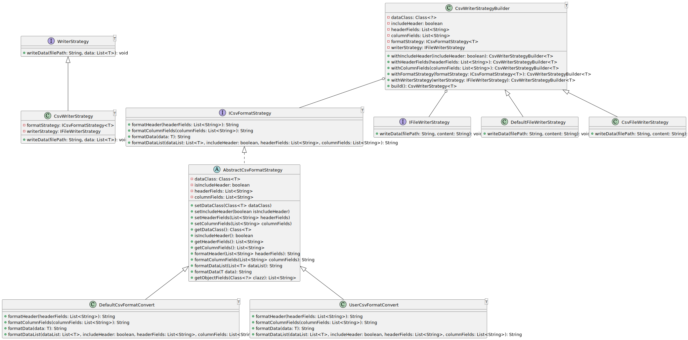

# lab1 file writer

- [lab1 file writer](#lab1-file-writer)
    - [1.CsvContentBuilder Demo](#1csvcontentbuilder-demo)
    - [1.CsvContentBuilder Demo](#1csvcontentbuilder-demo-1)
    - [1.0. 架構圖](#10-架構圖)
    - [1.2. 架構說明](#12-架構說明)
      - [WriterStrategy 策略](#writerstrategy-策略)
        - [WriterStrategy - CsvWriterStrategy 類別](#writerstrategy---csvwriterstrategy-類別)
      - [AbstractCsvFormatStrategy 抽象類別](#abstractcsvformatstrategy-抽象類別)
      - [Builder](#builder)
      - [具體的 CSV 格式化策略類別](#具體的-csv-格式化策略類別)
      - [WriterStrategy 介面](#writerstrategy-介面)
    - [1.3. 使用說明](#13-使用說明)
      - [csvWriterStrategyBuilderDemo\_default](#csvwriterstrategybuilderdemo_default)
      - [csvWriterStrategyBuilderDemo\_remove\_column](#csvwriterstrategybuilderdemo_remove_column)
    - [2.JsonContentBuilder Demo](#2jsoncontentbuilder-demo)
    - [2.0. 架構圖](#20-架構圖)
    - [2.2. 架構說明](#22-架構說明)
    - [2.3. 使用說明](#23-使用說明)
  - [3. 整合](#3-整合)

---

### 1.CsvContentBuilder Demo

這個範例展示了如何使用 `CsvContentBuilder` 類來生成 CSV 文件內容，並將其寫入文件。

---

### 1.CsvContentBuilder Demo

這個範例展示了如何使用 `CsvContentBuilder` 類來生成 CSV 文件內容，並將其寫入文件。

---

### 1.0. 架構圖

### 1.2. 架構說明

#### WriterStrategy 策略

- WriterStrategy<T>: 這是一個介面，定義了寫入器策略的基本方法。它有一個 writeData 方法，用於將資料寫入指定的檔案。

##### WriterStrategy - CsvWriterStrategy 類別

包括設定是否包含標題、標題欄位、資料欄位和格式策略等方法，並提供了一個 build 方法來構建最終的 CsvWriterStrategy<T> 物件。

- 相關參數:

  - includeHeader
  - headerFields
  - columnFields
  - formatStrategy
  - writerStrategy
  - CsvWriterStrategy<T>: 這是 WriterStrategy<T> 接口的具體實現類，用於處理 CSV 格式的資料寫入。它內部包含一個 ICsvFormatStrategy<T> 格式策略和一個 IFileWriterStrategy 檔案寫入策略，用於生成 CSV 內容並將其寫入檔案。

#### AbstractCsvFormatStrategy 抽象類別

- 實現了 ICsvFormatStrategy 介面，並提供了一些共用的屬性和方法供繼承類別使用
- 屬性

  - dataClass: Class<T>：用於儲存資料類別的 Class 物件。
  - isIncludeHeader: boolean：表示是否包含標題的旗標。
  - headerFields: List<String>：儲存標題欄位清單。
  - columnFields: List<String>：儲存資料欄位清單。

#### Builder

- CsvWriterStrategyBuilder<T>: 這是一個建造者模式的實現類，用於構建 CsvWriterStrategy<T> 物件。它包括設定是否包含標題、標題欄位、資料欄位和格式策略等方法，並提供了一個 build 方法來構建最終的 CsvWriterStrategy<T> 物件。

#### 具體的 CSV 格式化策略類別

有兩個具體的 CSV 格式化策略類別：DefaultCsvFormatConvert 和 UserCsvFormatConvert。這些類別繼承自 AbstractCsvFormatStrategy 類別並實現了相應的方法。

- DefaultCsvFormatConvert<T>: 這是 ICsvFormatStrategy<T> 接口的具體實現類，提供了默認的 CSV 格式策略。它內部包含了是否包含標題、標題欄位和資料欄位等參數，並實現了格式化標題、格式化欄位和格式化資料的方法。

#### WriterStrategy 介面

定義了寫入策略的方法，用於將資料寫入特定的輸出位置，例如檔案或其他目標

- method
  - writeData(filePath: String, data: List<T>): void：將資料寫入指定的檔案路徑。
- class
  - IFileWriterStrategy: 這是一個介面，定義了檔案寫入策略的方法。它有
  - DefaultFileWriterStrategy: 這是 IFileWriterStrategy 接口的具體實現類，提供了將內容寫入檔案的默認實現。

---

### 1.3. 使用說明

#### csvWriterStrategyBuilderDemo_default

這個示例函數演示了默認設置的用法。步驟如下：

1. 準備數據：使用 `getUserList` 函數獲取用戶列表。

2. 建立 `CsvWriterStrategyBuilder`：使用 `CsvWriterStrategyBuilder` 類建立一個 CSV 寫入策略生成器，指定用戶類型為 `User.class`。設置 `includeHeader` 為 `true`，表示包含 CSV 的標題行。未指定 `headerFields` 和 `columnFields`，將使用默認的欄位列表。

3. 建立 `CsvWriterStrategy`：調用 `build` 方法生成 `CsvWriterStrategy`。

4. 產生 CSV 文件內容：調用 `getCsvContentData` 方法，將用戶列表傳入，生成 CSV 文件內容。

#### csvWriterStrategyBuilderDemo_remove_column

這個示例函數演示了自定義設置的用法。步驟如下：

1. 準備數據：使用 `getUserList` 函數獲取用戶列表。同時，定義自定義的 `headerFields` 和 `columnFields`，分別指定所需的標題欄位和數據欄位。

2. 建立 `CsvWriterStrategyBuilder`：使用 `CsvWriterStrategyBuilder` 類建立一個 CSV 寫入策略生成器，指定用戶類型為 `User.class`。設置 `includeHeader` 為 `true`，表示包含 CSV 的標題行。設置 `headerFields` 和 `columnFields` 分別為自定義的欄位列表。

3. 建立 `CsvWriterStrategy`：調用 `build` 方法生成 `CsvWriterStrategy`。

4. 產生 CSV 文件內容：調用 `getCsvContentData` 方法，將用戶列表傳入，生成 CSV 文件內容。

---

### 2.JsonContentBuilder Demo

這個範例展示了如何使用 `JsonContentBuilder` 類來生成 CSV 文件內容，並將其寫入文件。

---

### 2.0. 架構圖

---

### 2.2. 架構說明

---

### 2.3. 使用說明

## 3. 整合

